# 魔法诗README.md

## 1、项目简介
魔法诗是一套基于前端开发框架 Vue3 开发的仅包含前端页面的响应式网站，此网页主要是通过静态的页面展示给用户一些炫酷的界面。无论是用在平时学校的小型练手项目，毕业设计还是在工作中的实际项目开发都可以有很好的参考作用。

## 2、项目环境
魔法诗仅仅是本地环境开发，不具备上线部署的功能，用户如果想要参考此项目的源代码，只需要拉取整个项目到本地即可快速进行二次开发。
-  拉取整个项目到本地
```shell
git clone https://github.com/Aubuary/magic-poetry.git
```
- 运行项目所需要的依赖资源

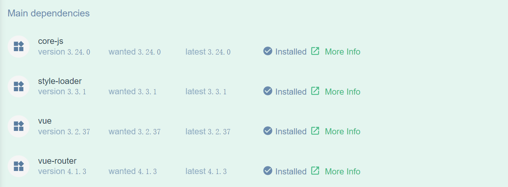
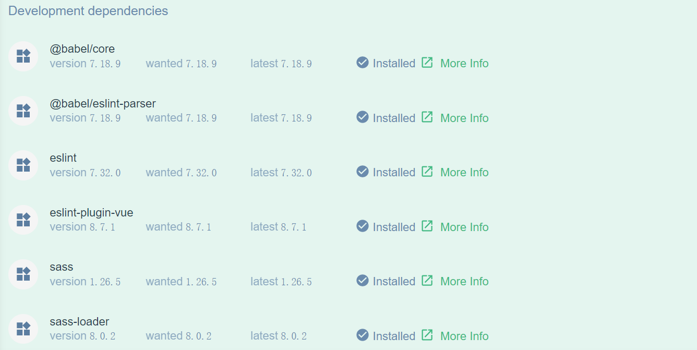


## 3、项目技术

1. vue3
2. vue cli
2. vue-router

## 4、网页界面

### 4.1 主界面
#### 4.1.1 页面预览

#### 4.1.2 界面说明
主界面所在的vue文件为App.vue，其中由动态背景视频和主界面构成。主界面又由头部组件（HeaderComponent.vue）和左侧组件（LeftComponent.vue）组成。


### 4.2 百宝箱
#### 4.2.1 页面预览
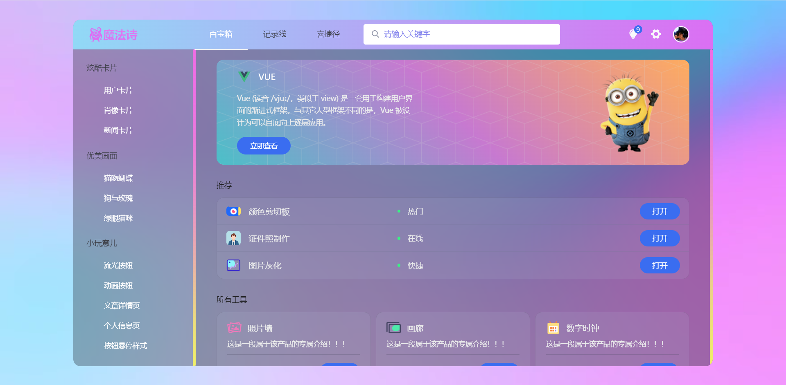
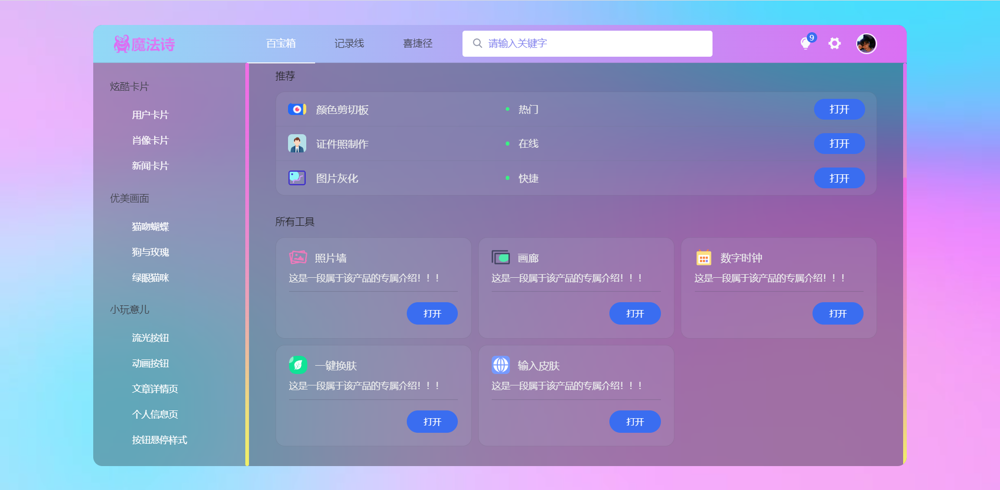
#### 4.2.2 界面说明
百宝箱所在的vue文件为TreasureView.vue，从上到下由组件ContentWrapper.vue、LineCard.vue、Block.vue组成。


#### 4.2.2 颜色剪切板
##### 4.2.2.1 页面预览
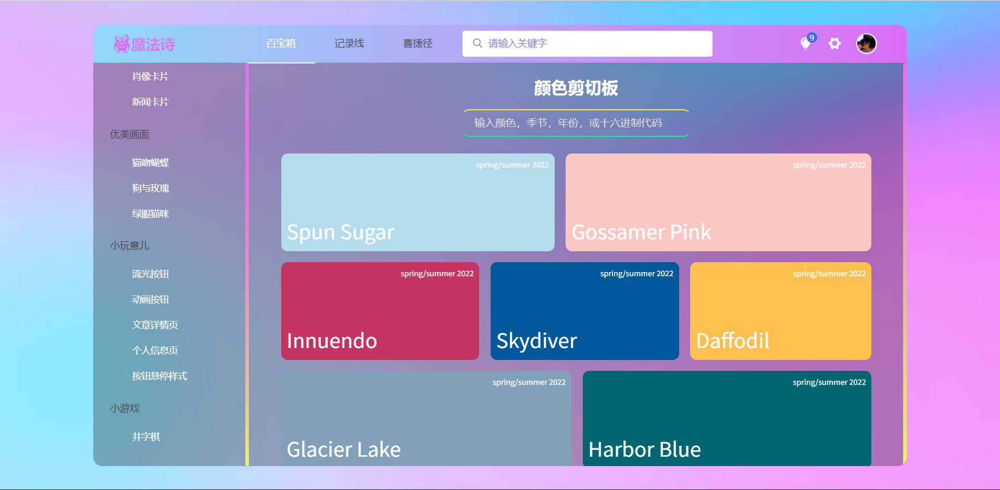
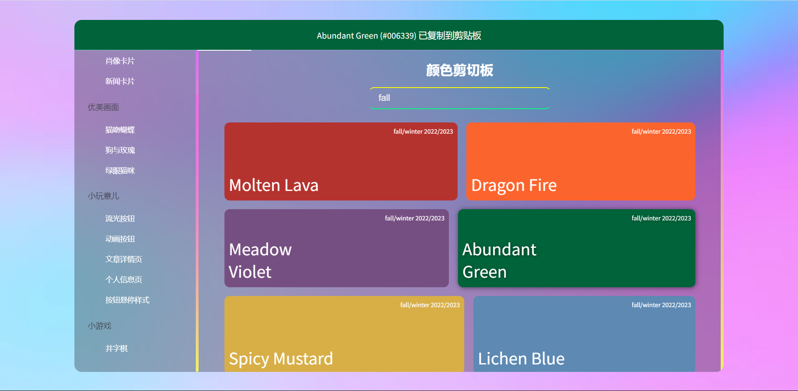
##### 4.2.2.2 界面说明
颜色剪切板所在的vue文件为ColorClipboardView.vue，进入到此页面，用户可以通过输入颜色、年份、季节或者十六进制代码来查询需要的颜色，点击颜色快就可以复制颜色的十六进制代码，如上图所示。

#### 4.2.3 画廊
##### 4.2.3.1 页面预览
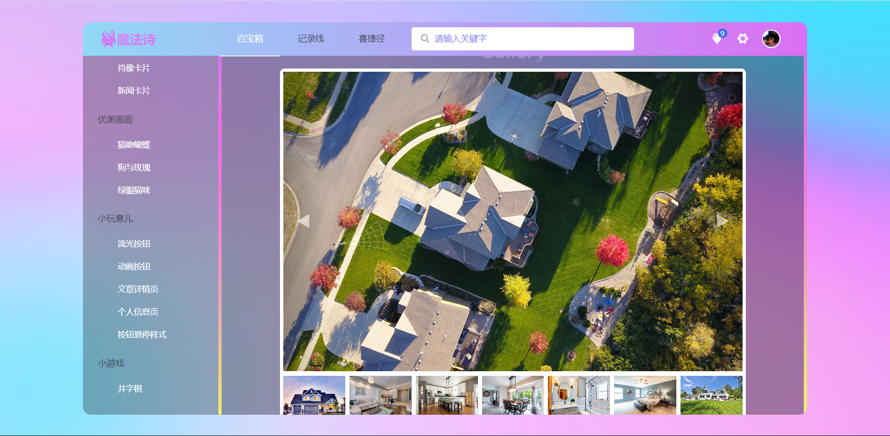

##### 4.2.3.2 界面说明
画廊所在的vue文件为GalleryView.vue，用户可以通过左右按钮来选择图片或者通过底部的图片列表来选择图片。

#### 4.2.4 数字时钟
##### 4.2.4.1 页面预览
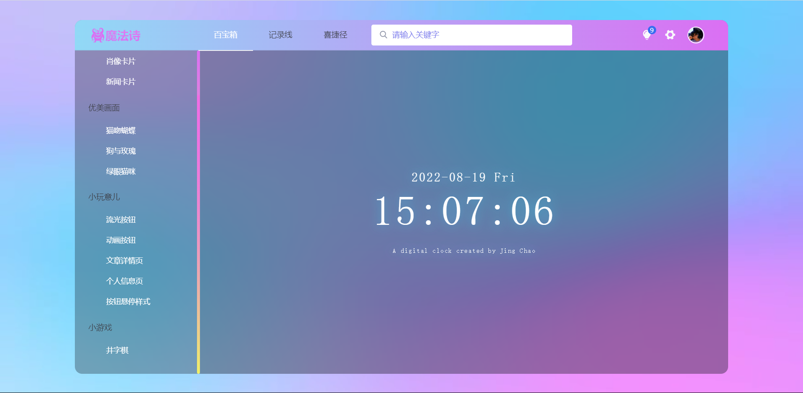
##### 4.2.4.2 界面说明
数字时钟所在的vue文件为DigitalClockView.vue，页面时间将动态更新。


### 4.3 记录线
#### 4.3.1 页面预览
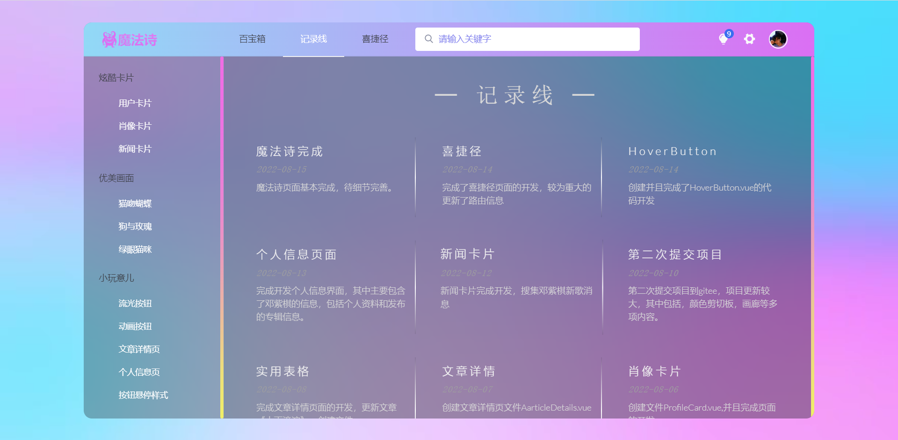
#### 4.3.2 界面说明
记录线所在页面的vue文件为RecordView.vue，页面使用flex布局实现横向的三栏布局，每个div通过nth-child选择是否显示右侧的border（即界面中的每个板块的白色分界线）


### 4.4 喜捷径
#### 4.4.1 页面预览


#### 4.4.2 界面说明
喜捷径所在页面的vue文件为ShortcutView.vue，页面中的各个板块使用ul、li标签，通过栅格布局实现。


### 4.5 炫酷卡片

#### 4.5.1 用户卡片
##### 4.5.1.1 页面预览
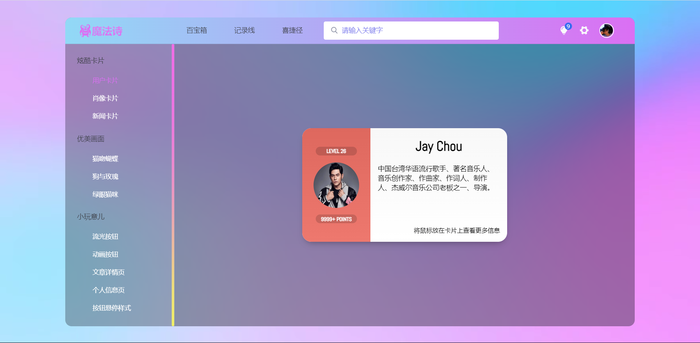
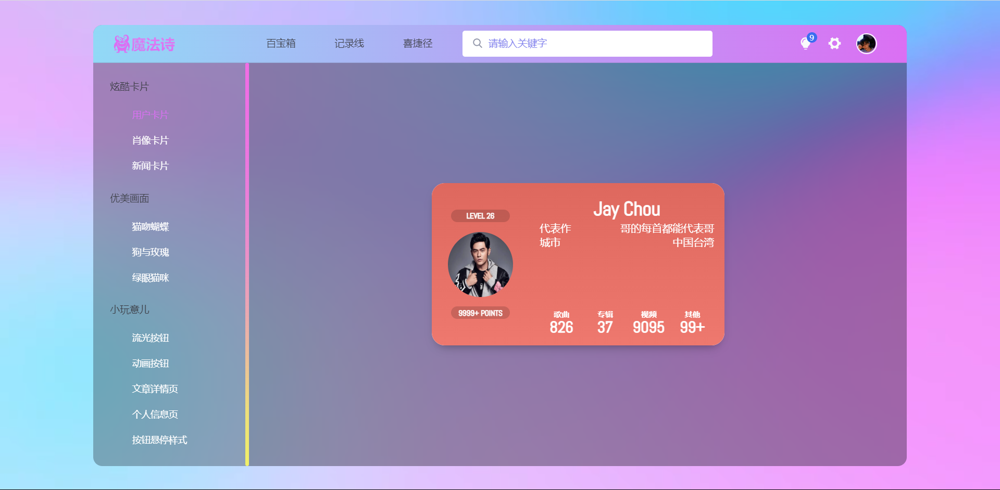

##### 4.5.1.2 界面说明
用户卡片所在的vue文件为UserCardView.vue，卡片有两种不同的状态，默认状态与鼠标划过状态分别如上图所示。


#### 4.5.2 肖像卡片
##### 4.5.2.1 页面预览
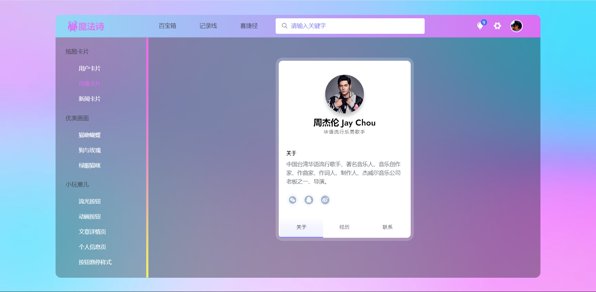
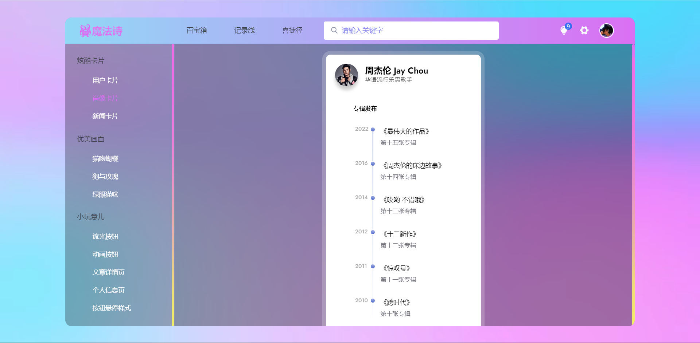
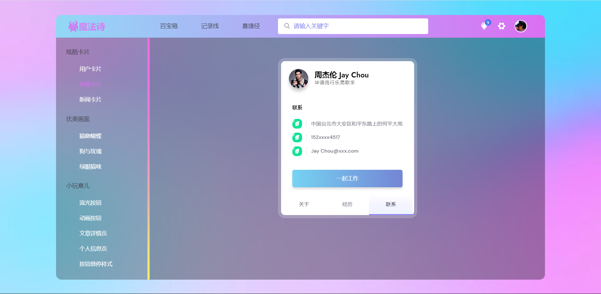

##### 4.5.2.2 界面说明
肖像卡片所在的vue文件为ProfileCardView.vue，肖像卡片有三种不同的样式，用户选择底部的按钮可以切换不同的状态进而可以展示不同的信息。具体实现细节参加项目源代码。

#### 4.5.3 新闻卡片
##### 4.5.3.1 页面预览
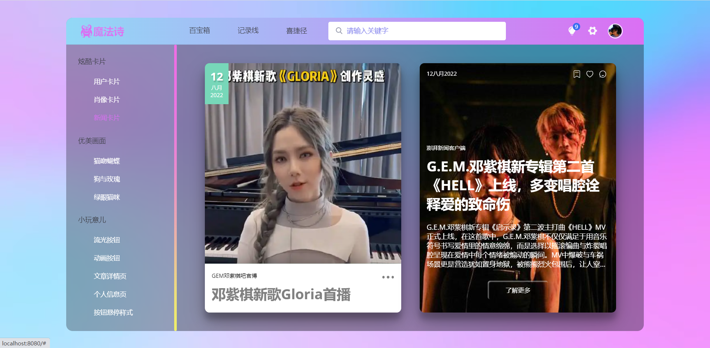

#### 4.5.3.2 界面说明
新闻卡片所在的vue文件为NewsCardView.vue，其中包含了两种不同样式的新闻卡片，用户鼠标滑动到卡片上即会动态展示除了标题外的更多信息（如卡片二所示）。


### 4.6 优美画面
#### 4.6.1 猫吻蝴蝶
##### 4.6.1.1 页面预览
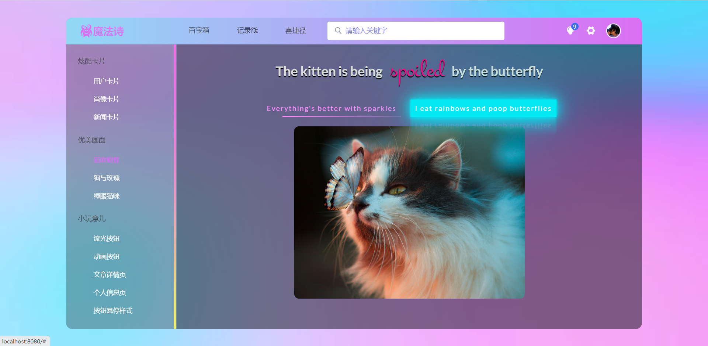

##### 4.6.1.2 界面说明
猫吻蝴蝶所在的vue文件为CatButterflyView.vue，其中图片上方的两个按钮皆为同一种类型的边框流动按钮，光标移动到按钮上的样式如图中的第二个按钮。

#### 4.6.2 狗与玫瑰
##### 4.6.2.1 页面预览
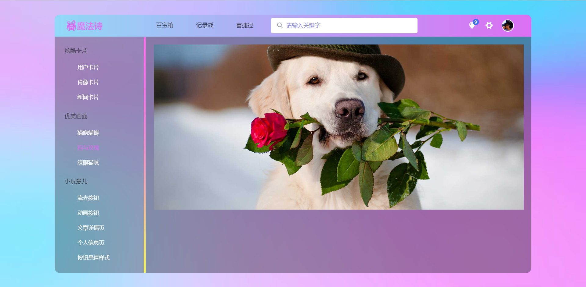

##### 4.6.2.2 界面说明
狗与玫瑰所在的vue文件为DogRoseView.vue，此页面纯属娱乐！

#### 4.6.3 绿眼猫咪
##### 4.6.3.1 页面预览
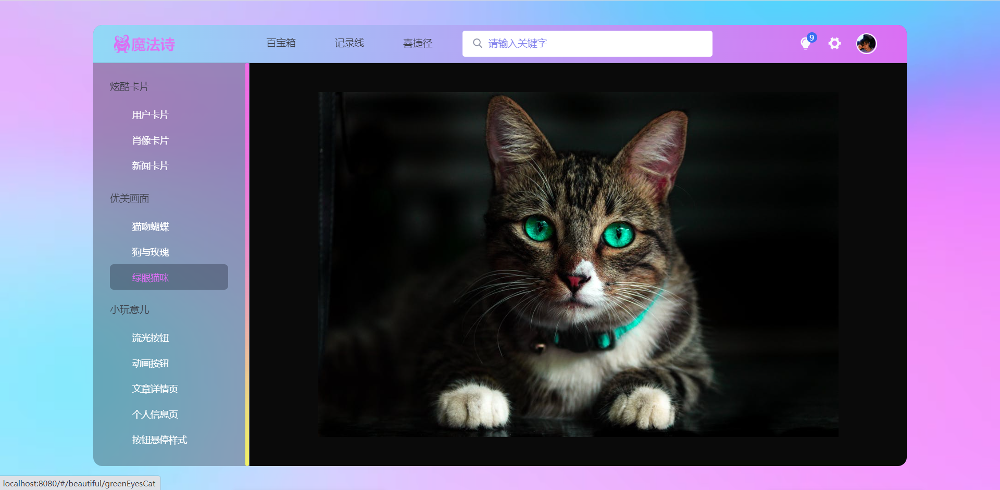

##### 4.6.3.2 界面说明
绿眼喵咪所在的vue文件为GreenEyesCatView.vue，此页面为一个动态加载的页面，主要为了从一开始的朦胧状态，到最后的清晰状态的展示。


### 4.7 小玩意儿

#### 4.7.1 流光按钮
##### 4.7.1.1 页面预览
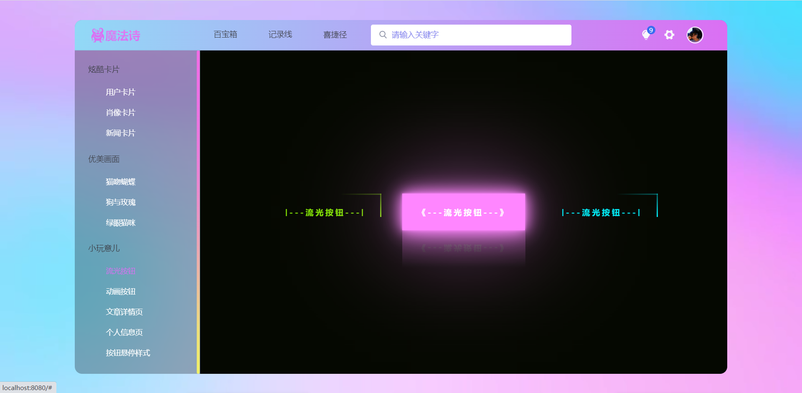

##### 4.7.1.2 界面说明
流光按钮所在的vue文件为TimeButtonView.vue，其中三个按钮均为同一种风格的按钮，他们拥有流动的边框，故我将其称作流光按钮，按钮选中后的样式如图第二个按钮所示。流光按钮并不是通过一对普通的button标签完成的，而是通过一对嵌套四对span标签的a标签实现的。具体实现细节参见源代码。


#### 4.7.2 动画按钮
##### 4.7.2.1 页面预览
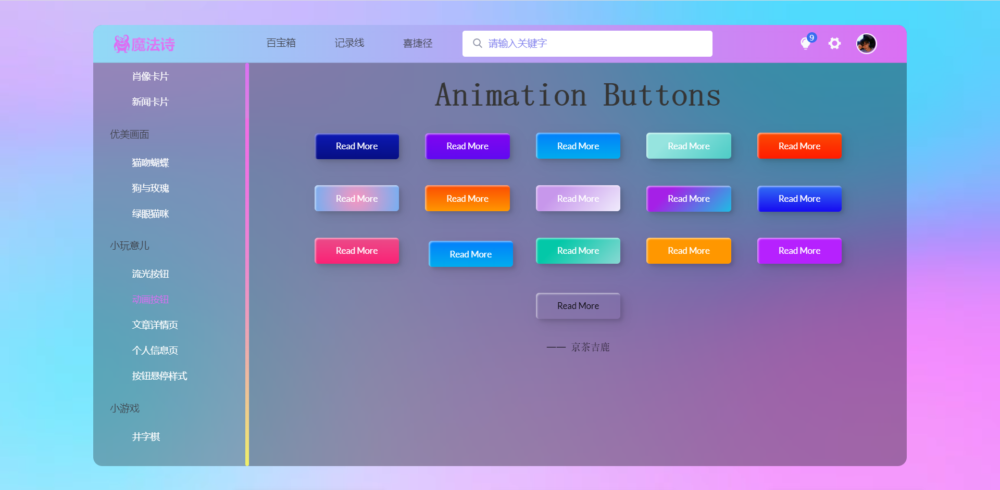

##### 4.7.2.2 界面说明
动画按钮所在的vue文件为AnimationButtonView.vue，其中每个按钮都是一种具有动画效果的按钮，各具风格。

#### 4.7.3 文章详情页
##### 4.7.3.1 页面预览
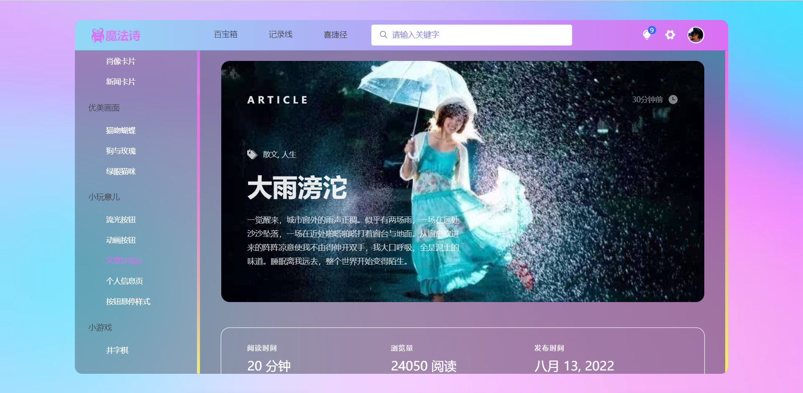
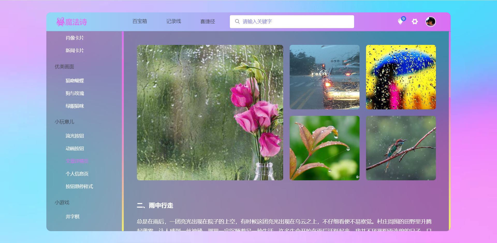


##### 4.7.3.2 界面说明
文章详情页所在的vue文件为ArticleDetailsView.vue，其中主要包含了封面介绍页，文章信息展示以及文章中的引用等。具体实现细节参见项目源代码。


#### 4.7.4 个人信息页
##### 4.7.4.1 页面预览
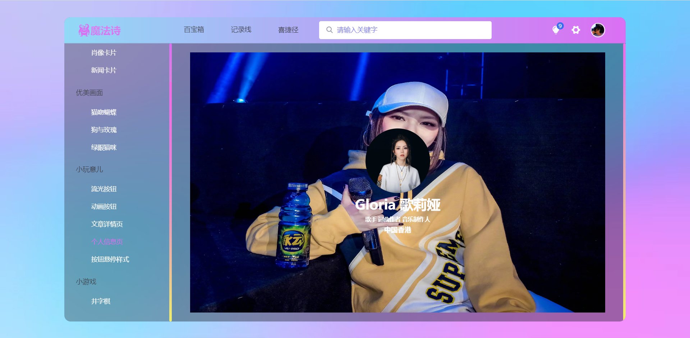
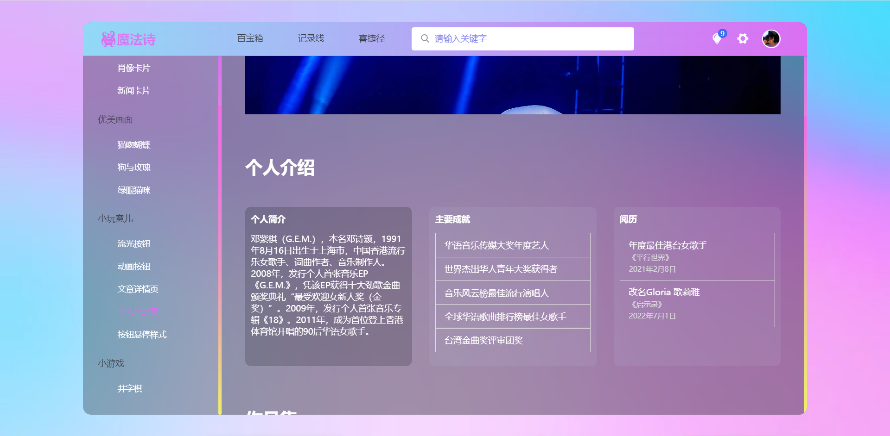

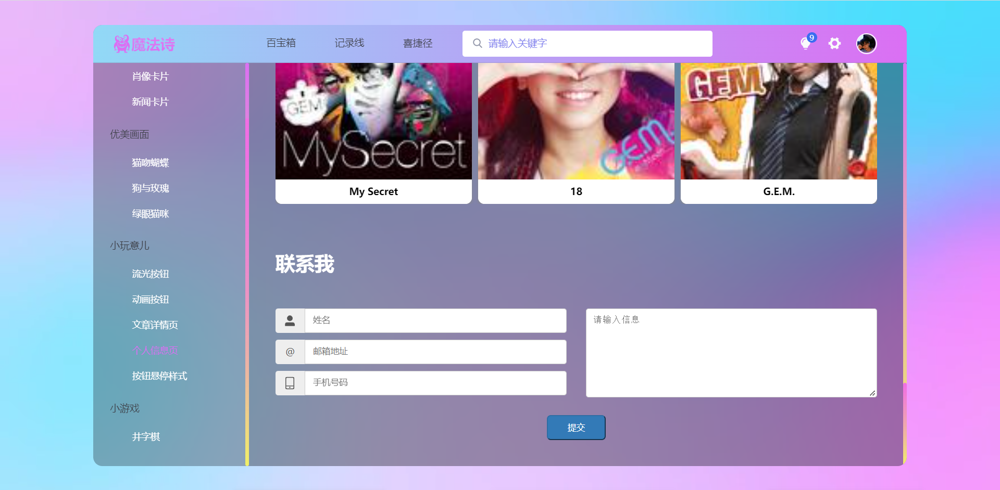

##### 4.7.4.2 界面说明
个人信息页所在的vue文件为PersonalInfoView.vue，其中主要包含了个人主界面（头像，身份，城市……），个人介绍部分，个人作品集和联系我们四部分，界面中均使用flex布局。

#### 4.7.5 按钮悬停样式
##### 4.7.5.1 页面预览
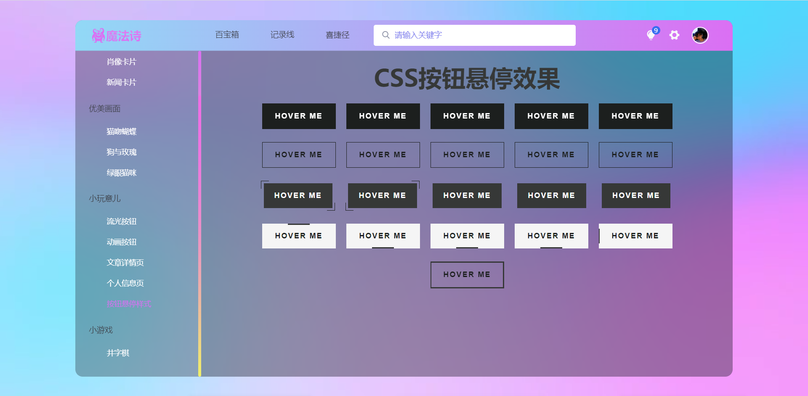

##### 4.7.5.2 界面说明
按钮悬停样式所在的vue文件为HoverButtonView.vue，此按钮与动画按钮相比较更加的朴素，低调，但是每个按钮也都具备了自己的特点，详细参见项目源代码。


#### 完

